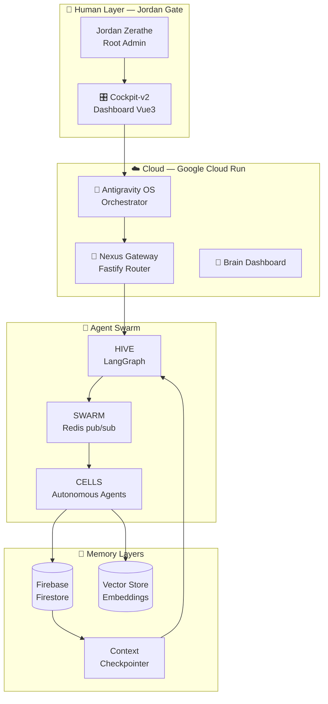

---

## 🍄 Vision

> *"Mycelium is not a product. It's a living architecture — a swarm of AI agents coordinating like fungal networks underground, invisible yet omnipresent."*
>
> — Jordan Zerathe, Founder

Myxelium-Corp construit une **plateforme d'orchestration multi-agents IA** biomimétique.  
Chaque agent est une **cellule** dans un réseau vivant, capable de mémoire, d'apprentissage et de coordination autonome — sous supervision humaine stricte (HITL).

---

## 🧬 Architecture Mycelium OS

---

## 🗂️ Repositories

| Repo | Description | Status | Stack |
|------|-------------|--------|-------|
| [🧠 Mycelium-AI-core](https://github.com/Myxelium-Corp/Mycelium-AI-core) | Core IA : agents, OMEGA mission, Firebase checkpointer | 🟢 Actif | TS · LangGraph · Firebase |
| [⚙️ Mycelium-Dev](https://github.com/Myxelium-Corp/Mycelium-Dev) | Monorepo : cockpit-v2, core-api, Docker infra | 🟡 CI fix PR#11 | Vue3 · Express · Docker |
| [🌐 Open-Mycelium](https://github.com/Myxelium-Corp/Open-Mycelium) | Documentation publique & specs | 🟢 Actif | Markdown |
| [📚 Myxelium-Doc](https://github.com/Myxelium-Corp/Myxelium-Doc) | Wiki technique | 🟡 En construction | Markdown |

---

## 🛠️ Stack Technologique

  
  
  
  
  
  
  
  
  
  

---

## 🔒 Gouvernance & Principes

| Principe | Implémentation |
|----------|---------------|
| **Zero Trust** | Chaque agent a des droits minimaux, auditables |
| **Human-In-The-Loop** | Jordan = seul décisionnaire final (Jordan Gate) |
| **Source of Truth** | `Mycelium-AI-core/OMEGA_MISSION_CONTROL.md` |
| **Branch Policy** | PRs obligatoires, CI vert requis avant merge |
| **Audit Trail** | Chaque action loguée dans Firestore |

---

## 🌟 Contribuer

> ⚠️ **Repos privés actuellement.** Ouverture progressive planifiée.

Pour collaborer :
1. Contacter **[@Drag0n69](https://github.com/Drag0n69)**
2. Review de code par des personnes de confiance via GitHub PRs
3. Zero Trust appliqué à chaque nouveau collaborateur

---

## 📫 Contact

  
  
  

---

🍄 Mycelium OMEGA — <em>Sovereignty & Intelligence</em> — Built with ❤️ by <a href="https://github.com/Drag0n69">Jordan Zerathe</a>

